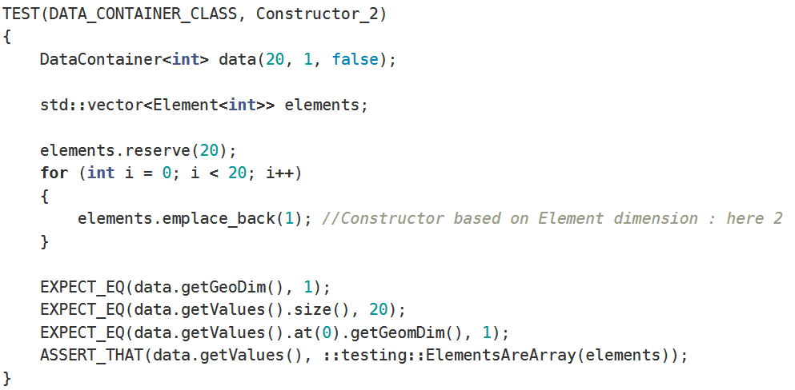

## Tasks splitting & Project Organization
After discussing the general structure of the project, we listed a set of tasks to be performed. Those were written as tickets on the trello online management tool. These tasks were distributed between architecture, development, deployment (and later on test, correction and integration tasks) tickets. The team members thus assigned themselves the tasks with which they were most comfortable or wished to progress on. Sometimes for certain developmental tasks, team members would pair up for learning and efficiency purposes.

## Functional and non-functional specifications
functional aspect:
    the project must be able to segment a set of data into different clusters. These data as well as their dimensions can be randomly generated by the user. 
    He will only have to specify the number of data and the desired dimension. 
    The data set can also be a colored or grayscale image. 
    However the user will have to choose the number of clusters he want to split the data set in.
non-functional aspect:
    the project has been coded in C++ for more robustness and an optimal control of its memory and thus gain in execution time. A class architecture has been chosen, to facilitate its maintenance and work organisation. Unit tests were performed throughout the project to ensure the quality of the code, its reliability and its proper functioning. These tests are even performed during the continuous integration of the code on git through a pipeline, in order to have a better traceability and to ensure the coherence of the code.
    The code is delivered with a CmakeList.txt so that it can be launched by anyone, on any OS, once the code has been downloaded, thus increasing the portability of the project, which can be built in two commands. 
    A CLI is also provided to allow quick and easy access to the program and its uses. A "help" is available for readability and understanding. 

## Roles Assignment
we discussed together the architecture of the project. Then we splitted the team into 3 small groups for the subtasks. Each subtasks correspond to a module to develop. Due to that we could split the work into development part and testing. each member had to develop a part and test the other part. this way we ensured a more functional and better quality code, with less forgetting and therefore easier to debug. 
Ouadie set up the test environement, and Rami handled the continuous integration by taking care of the git environement. We all run a different runner for the pipelines.

## Project completion convergence

the tasks described above were grouped in lists, one list for development, one for architecture, one for testing and one for continuous integration for exemple.
These lists were dispayed on trello and could be tracked, as well as their sub-tasks. We could thus check the good progress of the project as well as its delay and verify that everything was going in the right direction.

## Inter-members communication

As mentioned above, we use trello to track project progress, project management and task sharing. For internal communication we use slack to communicate with each other in real time and to exchange information or help if needed. Stand up metings were done every 3 days on average, to review the general progress of the project, discuss any blockages or necessary restructuring.

## Quality insurance

the quality of the project is tempted to be ensured thanks to unit tests carried out by someone other than the developer. Tests are also carried out by the pipeline after pushing the code on git. If they fail it is impossible to merge the said branch on the master. This ensures that the master remains clean and contains functional code. Each feature is attempted to be developed on a branch. This makes the project clearer and therefore ensures the quality of the project. when we ask to merge a branch into the master, someone else than the owner of the merge request, has to validate it after he reread the code.
making sure of the code a little more. 

## Tests :

### +Tests creation : 

To ensure the proper functioning of our program, we have created component tests for each function/use of each of our classes. 

We used mainly **googleTest** _unit testing_ library for the C++ . We choose this library for to its flexibility, its functions variety and because it doesn't require a huge source code modification. 

Due to the level of complexity of our structure, our main focus was on testing the bigger constructors, and that by verifying their runtime, complexity, memory usage and usability. And during this process, we made sure to comment every test to make its use and purpose clear. The picture below shows an example of these tests on the **dataContainer Class ** :

this example tests one of the dataContainer _contructors_ , the _EXPECT_EQ_ outputs the unmatched values in case our container isn t well constructed and by the values we choose. 

​

We made sure that we make our tests as independent as possible (without requiring a human interaction) ad random as possible by randomizing the most of the input parameters.

### +Tests running/exploitation :

 **The compilation process** : In order to verify our code by using our tests, we had to compile them, in this process we followed the steps below :

> - Creating **_CMakeLists_** files : we created for every sub-diretory of our project its specific  _CMakeLists_ in which we mentionned all our tests (that are already known as executables) in order to be treated as such and be passed to the ctest . we also created a main _CMakeLists_ in our root directory to  configurate our whole environement and fix any compilation issue that may occur as long as setting the global variable and linking external libraries like _googleTest_ .

> - Building the project using cmake and testing it with ctest : In this step we run our project on the debug mode, which creates our executables and notify us if there is any kind of error. After making sure that there is none, we run our test executables (we made sure to use the _--verbose_ parameter to have a clear and detailed vue on our tests outputs in order to correct any unwanted (wrong) result. Running the ctest directly (without the --verbose command) can sometimes be used on the release mode, juste to make sure that our code works correctly without the need of having any detail.

>  - running tests manually : running tests manually (as executables without using ctest) can often be useful if we want to dig into one of our tests for a vue more specific with more details.

​

## GitLab CI use :

### +GitLab runner :

We preferred to use our already existant runners that we created in through the course using the GitLab initialisation code (by configuring the server, specifying the gitlab runner image, ...)

Those commands were : 

-- for initialisation :

​

    $ docker run --rm -it \

    -v gitlab_runner:/etc/gitlab-runner \

    --name gitlab-runner \

    gitlab/gitlab-runner \

    register \

    --non-interactive \

    --executor "docker" \

    --docker-image alpine:3.9 \

    --url "https://gitlab.com/" \

    --registration-token "PROJECT_REGISTRATION_TOKEN" \

    --description "` >

we changed of course the "PROJECT_REGISTRATION_TOKEN" and the url  by ours.

--  for lunching the runner :

​

    $ docker run -d --name gitlab-runner \

    --restart always \

    -v gitlab_runner:/etc/gitlab-runner \

    -v /var/run/docker.sock:/var/run/docker.sock \

    gitlab/gitlab-runner

​

We continued to manage afterwards our runners using the _GitLab_ interface. 
